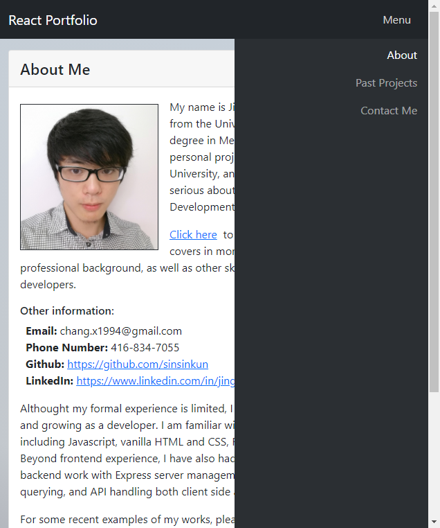
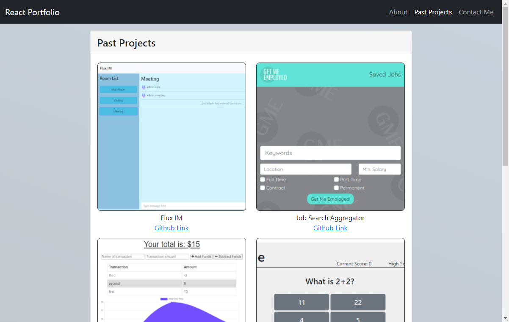

# Unit 20 React Homework: React Portfolio

## Description
This is a quick and simple portfolio site made in react with considerations for responsive design. 
It highlights some of my personal information as well as serving as a way to display some projects 
I have worked on in the past.

Link to live website: [https://sinsinkun.github.io/React-Portfolio/](https://sinsinkun.github.io/React-Portfolio/)

## Table of Contents
* [Usage](#usage)
* [License](#license)

## Usage
Visit the link to view the website. Screenshots below:

## License
ISC License: Copyright (C) 2021 JingChang Xiao 

Permission to use, copy, modify, and/or distribute this software for any purpose with or without fee is hereby granted, provided that the above copyright notice and this permission notice appear in all copies. 

THE SOFTWARE IS PROVIDED "AS IS" AND THE AUTHOR DISCLAIMS ALL WARRANTIES WITH REGARD TO THIS SOFTWARE INCLUDING ALL IMPLIED WARRANTIES OF MERCHANTABILITY AND FITNESS. IN NO EVENT SHALL THE AUTHOR BE LIABLE FOR ANY SPECIAL, DIRECT, INDIRECT, OR CONSEQUENTIAL DAMAGES OR ANY DAMAGES WHATSOEVER RESULTING FROM LOSS OF USE, DATA OR PROFITS, WHETHER IN AN ACTION OF CONTRACT, NEGLIGENCE OR OTHER TORTIOUS ACTION, ARISING OUT OF OR IN CONNECTION WITH THE USE OR PERFORMANCE OF THIS SOFTWARE.